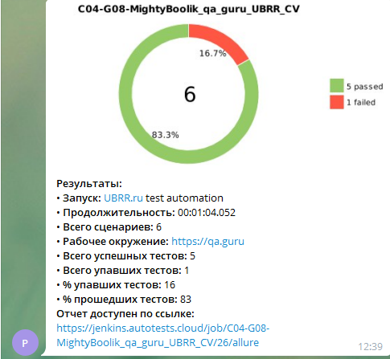

## Автотесты для сайта https://www.ubrr.ru/
**Реализованы тесты:**
- [X] - Проверка загрузки основных элементов на главной странице.

- [X] - Проверка кнопок "Интернет-банк"и"Заказать звонок".

- [X] - Тест заполнения анкеты для посещения офиса банка.

- [X] - Тест слайдера в кредитном калькуляторе.

## :video_camera: Запись видео с помощью Selenoid

## Для отчётности использован Allure

## Telegram-уведомления

