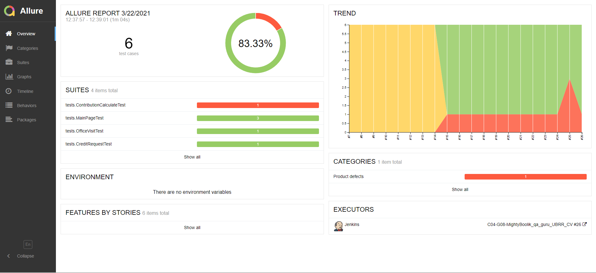
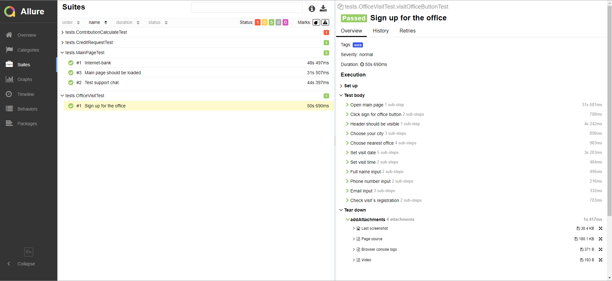
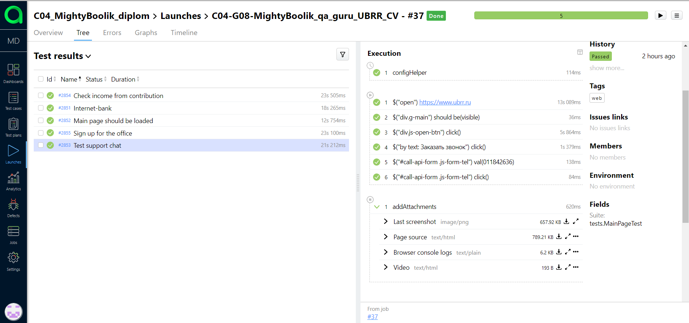
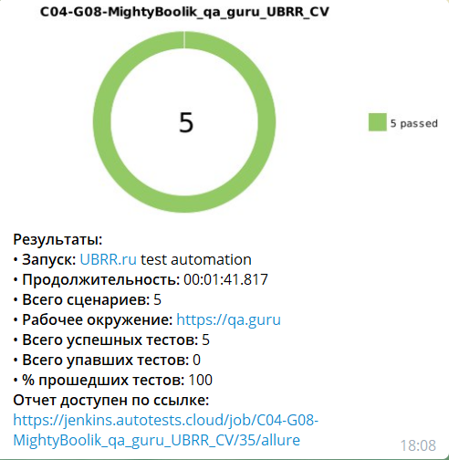
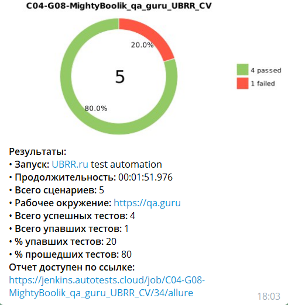
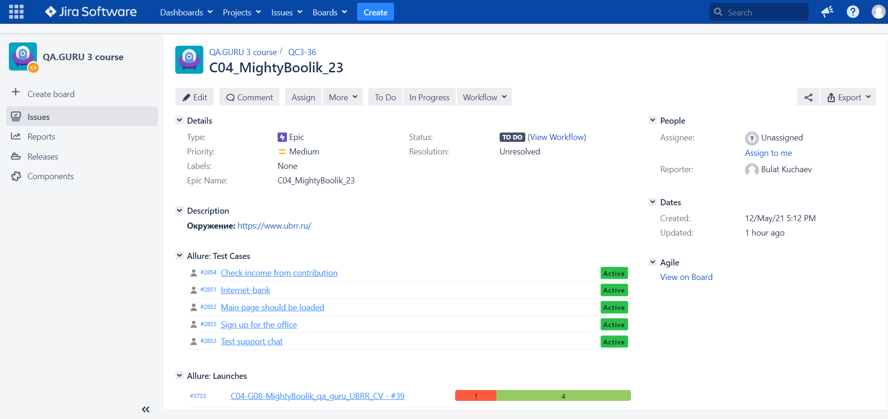

## Автотесты для сайта https://www.ubrr.ru/
**Реализованы тесты:** :j:

:heavy_check_mark: - Проверка загрузки основных элементов на главной странице.

:heavy_check_mark: - Проверка кнопок "Интернет-банк"и"Заказать звонок".

:heavy_check_mark: - Тест заполнения анкеты для посещения офиса банка.

:heavy_check_mark: - Тест слайдера в кредитном калькуляторе.

## :video_camera: Запись видео с помощью Selenoid

## В качестве CI использован Jenkins

## :bar_chart: Просмотр результатов теста с помощью Allure

## :envelope: Поддержка Telegram-уведомлений

## Интеграция с Jira

