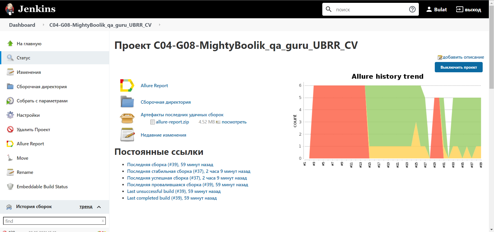

## Автотесты для сайта https://www.ubrr.ru/

**Реализованы тесты:**

- [X] Проверка загрузки основных элементов на главной странице

- [X] Проверка кнопок "Интернет-банк"и"Заказать звонок"

- [X] Тест заполнения анкеты для посещения офиса банка

- [X] Тест слайдера в кредитном калькуляторе

## :video_camera: Запись видео с помощью Selenoid

## :hammer_and_wrench: В качестве CI использован Jenkins

## :bar_chart: Просмотр результатов теста с помощью Allure

## :envelope: Поддержка Telegram-уведомлений

## :information_source: Интеграция с Jira

